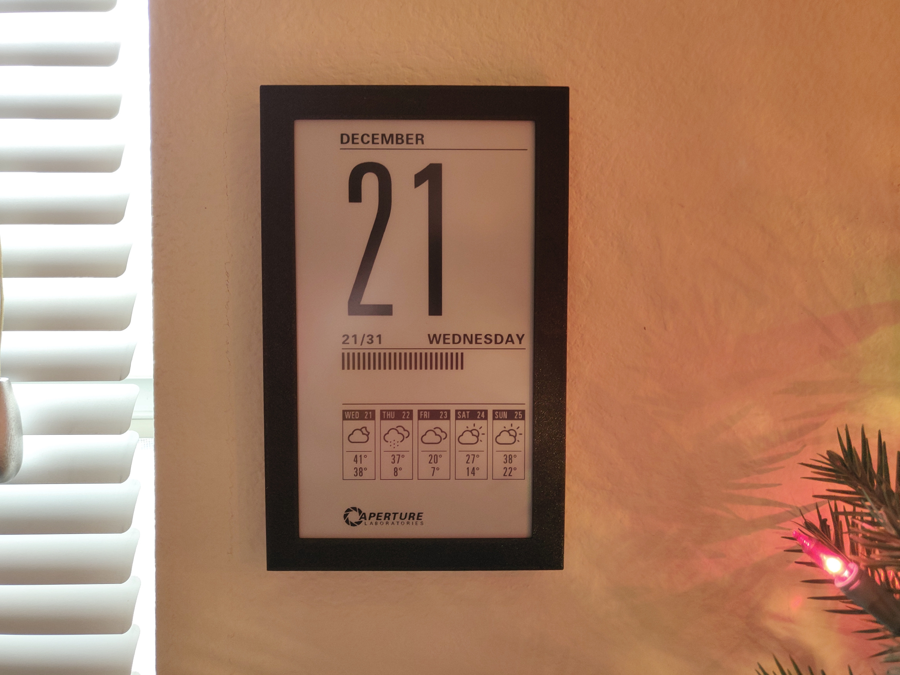
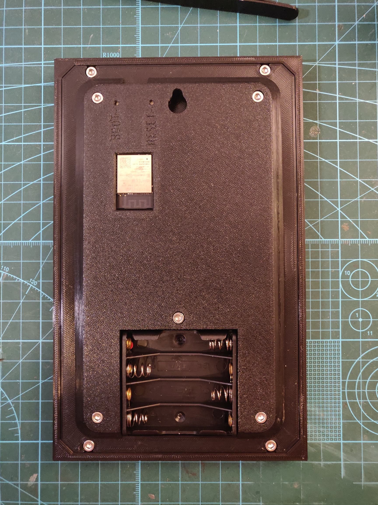
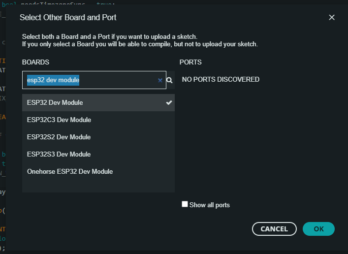
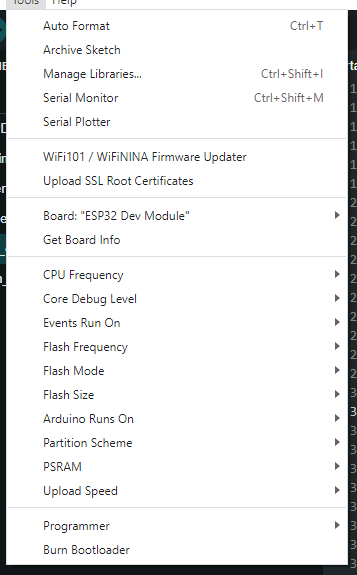

# Portal Calendar

An ESP32 based, Portal themed e-ink calendar that can run on AAA batteries for years, with optional weather integration through OpenWeatherMap.

- [Bill of Materials](#bill-of-materials)
- [Assembly](#assembly)
- [Firmware](#firmware)
- [More Info](#more-info)
  - [Timekeeping](#timekeeping)
  - [Graphics](#graphics)
- [License](#license)

This project was inspired by Reddit user u/feefifofeddit who made [a prototype of a Raspberry Pi-powered Portal calendar](https://www.reddit.com/r/RASPBERRY_PI_PROJECTS/comments/qujt3i/wip_portal_desktop_calendar/). Unfortunately the display they used has been discontinued, and I wanted a battery powered and wall mountable version, so I designed my own based on the ESP32 platform with the goal of being as low-power and game accurate as possible.

By default, chamber hazard icons from both Portal and Portal 2 are shown below the current date. Portal icons are shown for day 1 through 16, while Portal 2 icons are shown for day 17 through 31.

With the weather feature enabled, the chamber hazard icons are replace by either a 5-day or 12-hour weather forecast provided by OpenWeatherMap that shows the average weather condition, the high & low temperatures, the chance of rain, or the humidity, at your preference.

The weather icons are based on the designs by Lukas Bischoff and Erik Flowers, available [here](https://github.com/erikflowers/weather-icons/).

# Bill of Materials

- **Waveshare 7.5" 800x480 E-Ink display**
  
    Available [directly from Waveshare](https://www.waveshare.com/product/displays/e-paper/epaper-1/7.5inch-e-paper-hat.htm) or [from Amazon](https://www.amazon.com/gp/product/B075R4QY3L). The display itself is the Good Display GDEW075T7, Waveshare just resells it and gives you a breakout board.

    Make sure you buy the bare display with breakout board. Don't buy the one preinstalled in a case. Don't buy the Black/White/Red version of this display either, just the standard Black/White one.

    This display is intended only for 2-color greyscale (full black or full white, with no grey levels). However, this code does some hacks to it to make it support 4-color greyscale for better antialiasing. I didn't invent this technique, the [GxEPD2](https://github.com/ZinggJM/GxEPD2_4G) project among others does the same thing. The downside of doing this, however, is that results can vary from display to display. The greyscale levels may not look as good on your particular display as they do on mine. I've tried to design the graphics with that in mind so that the grey level isn't critical to get things to look good, but I've only tried this on one display, and I can't guarantee yours will look perfect.

- **EzSBC ESP32 breakout board**

    Available [here](https://www.ezsbc.com/product/esp32-breakout-and-development-board/). This will run on any ESP32, but this particular board is perfect for alkaline battery power due to its efficient voltage regulator and flexible input voltage. If you use a different board, you will need to modify the case and come up with your own power solution.

- **4xAAA battery holder**

    Pretty much all of them will work. [This is a good one](https://www.pololu.com/product/1145/specs).

- **9x M3x8 cap head screws**

# Assembly

This project requires soldering, I'm sorry. Unfortunately I didn't take many pictures during the assembly of mine but it should be fairly straightforward how things go together.

1. Print [front.stl](frame/front.stl) and [back.stl](frame/back.stl). Once those are done you can start putting things together, and get [cover.stl](frame/cover.stl) printing while you work. Print with a **0.2mm layer height**, other than that print settings really don't matter that much.
2. Remove the protective film on the front of the e-ink display if it has one (there should be a red or green tab in one corner you can pull).
3. Insert the display into [front.stl](frame/front.stl), oriented so the ribbon cable goes into slot on the side. The easiest way to do this is to gently pre-bend the ribbon cable, then slide the display in from the opposite side.

    

    This should go without saying, but the display and the ribbon cable connection are very fragile. Here's a close-up of how the ribbon cable should seat in the slot

    

    Once it's inserted, make sure the display is sitting flat and that the edges of the display are flush with the ledges on the top and bottom.

4. Insert [back.stl](frame/back.stl) on top of the display, flat side down, being careful that the ribbon cable doesn't get snagged when sliding in the slot on the side.
   
   

   The back cover should be flush with the edges of the front cover. If it's not, the display may not be seated correctly in the front cover. Don't try to force it, remove the back cover and re-seat the display.

   Once the back cover is installed, you can secure it with an **M3x8** screw in each corner.

5. Insert the e-Paper Driver HAT into the slot by the ribbon cable and clip the ribbon cable into the connector. Make sure you get it fully seated in the connector, and **make sure to latch it closed**, otherwise the display may not work when you try to power it on. Also, make sure the **Display Config** switch is in the **B** position, and the **Interface Config** switch is in the **0** position.
6. Now the fun part begins, cutting wires to length and soldering them to the ESP32. Note the colors listed below are the ones used in the wiring harness I got, yours is probably the same but it may be different if Waveshare changed it.

    | e-Paper HAT   |     | ESP32 |
    | ------------  | --- | ----- |
    | VCC (Grey)    | <-> | 3.3v  |
    | GND (Brown)   | <-> | GND   |
    | DIN (Blue)    | <-> | IO13  |
    | CLK (Yellow)  | <-> | IO14  |
    | CS (Orange)   | <-> | IO15  |
    | DC (Green)    | <-> | IO23  |
    | RST (White)   | <-> | IO33  |
    | BUSY (Purple) | <-> | IO27  |

    

7. Glue in the battery holder (I used JB weld plastic bonder), and solder the red and black wires to the **Vin** and **GND** pins on the ESP32. 

8.  Make sure all the wires are inside the recess on the back cover so they aren't pinched, and make sure the ESP32 is seated in its recess. Then you can install [cover.stl](frame/cover.stl) and secure it with an **M3x8** screw in each corner, and one in the center above the battery holder.

    

    There's no point in putting the batteries in yet since the ESP32 still needs to be programmed.

# Firmware

Read through [config.h](config.h) and fill out the required values. At a minimum, you need to fill out `WIFI_NAME`, `WIFI_PASS`, and `TIME_ZONE`. A WiFi connection is required to keep the ESP32's internal clock synchronized, and to get weather information from OpenWeatherMap if you have that enabled.

The firmware can be built and flashed with the Arduino IDE after you've installed the ESP32 boards package 2.0+ and ArduinoJson 6.20+.

To install the ESP32 boards package, go to `File -> Preferences` and add the following URL to `Additional Boards Manager URLs`

    https://raw.githubusercontent.com/espressif/arduino-esp32/gh-pages/package_esp32_index.json

Then, go to `Tools -> Boards -> Boards Manager...` and search for esp32

Then, select `ESP32 Dev Module` for your board.

Once that's selected you'll see a bunch of other options show up in the Tools menu.

 The defaults *should* already be what you want, but make sure they match these settings.

 | Option | Value |
 | ------ | ----- |
 | CPU Frequency | 240 Mhz (WiFi/BT) |
 | Core Debug Level | None |
 | Events Run On | Core 1 |
 | Flash Frequency | 80Mhz |
 | Flash Mode | QIO |
 | Flash Size | 4MB (32Mb) |
 | Arduino Runs On | Core 1 |
 | Partition Scheme | Default 4MB with spiffs (1.2MB APP/1.5MB SPIFFS) |
 | PSRAM | Disabled |
 | Upload Speed | 921600 |

Now you can just flash it like any other arduino.

# More Info

## Timekeeping

The internal clock in the ESP32 is very inaccurate with a specified inaccuracy of 5%, which corresponds to 72 minutes per day. This is obviously useless for long-term timekeeping so an external clock is required. One solution would be to use an RTC module like a DS3231, but that still requires an external time source for initialization. Given that, I decided to just ditch that extra cost and require a WiFi connection for daily NTP time syncing, which would be required for OpenWeatherMap anyway if you decide to use it. The default NTP servers are `pool.ntp.org` and `time.google.com`, and can be changed in config.h if you want.

The WiFi connection is also used to lookup information for the timezone you provide, using the `timezoned.rop.nl` service from the [ezTime project](https://github.com/ropg/ezTime). Timezoned is a relatively small service maintained by one person, so it does introduce a failure point if it ever goes down. If that's something you're worried about you have a couple options

* Host your own timezoned service. The source code is available in the ezTime repository.
* Provide a POSIX timezone instead of a timezone name, as explained in config.h.

## Graphics

Like I mentioned in the [Bill of Materials](#bill-of-materials) section, I'm doing some hacky stuff with the e-ink display to get it to support 4-color greyscale, both for antaialising and so the inactive chamber icons look better. The specifics on how all this works are outside the scope of this readme, but if you'd like to learn the basics of how e-ink displays work I recommend watching [Applied Science's video](https://youtu.be/MsbiO8EAsGw).

A consequence of this is that I've had to write my own simple 2-bit drawing library for this project, since [Adafruit GFX](https://github.com/adafruit/Adafruit-GFX-Library) doesn't support that and I don't know of any other libraries that do. The low-level code for drawing to the display is located in [DisplayGDEW075T7.cpp](DisplayGDEW075T7.cpp), which includes low-level drawing commands like `setPx`, `drawVLine`, `drawHLine`, `fillRect`, and `strokeRect`, but also more advanced commands like `drawImage`, `drawText`, and `drawMultilineText`, which I'd like to explain a bit further in case you want to modify the icons or fonts used in this project.

All of the bitmap and font resources are in the [resource](resource) directory, which can be compiled to C header files using [build_image.py](resource/build_image.py) and [build_font.py](resource/build_font.py) respectively. I chose to simply compile resources to C code that can be embedded into the firmware instead of loading them from the ESP32's SPIFFS because it greatly simplifies the flashing process.

The build_image.py script can take in any image format supported by PIL and will output a C header file of the same name that can be included and drawn to the display. All of the images used in this project are inclued in this repo both as the original GIF images and the compiled C header files.

The build_font.py script will take in TrueType or OpenType fonts and output a bitmap font rendered at the specified size to a C header file. Look at [build_fonts.sh](resource/build_fonts.sh) for usage examples. Unlike for the images, I haven't included the source fonts in this repository because they are the original, proprietary fonts used in the Portal games. If you want to rebuild those fonts, it's up to you to find them online.

# License

* All code in this repository is licensed under the MIT license.
* All images in this repository are licensed under the Creative Commons Attribution-NonCommercial license.
* All STL and 3D CAD files in this repository are licensed under the Creative Commons Attribution-ShareAlike license.
